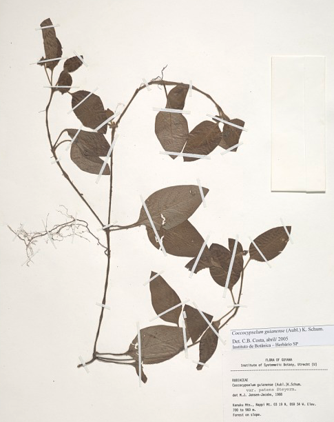
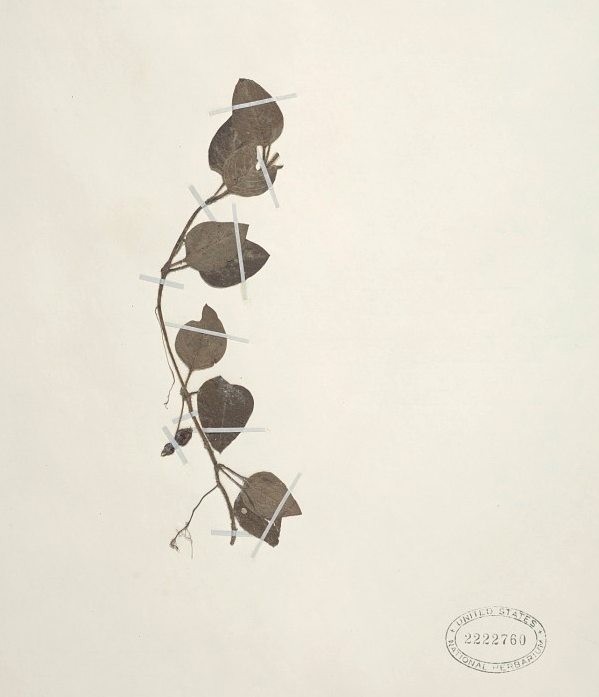
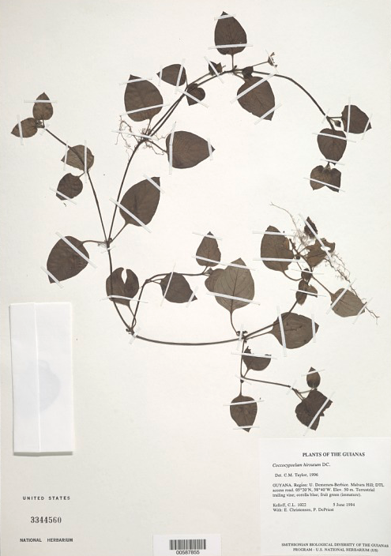
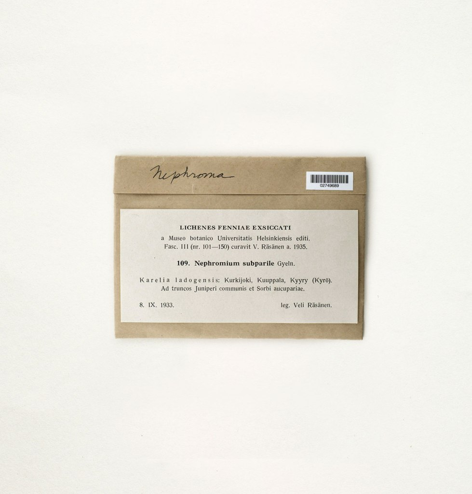
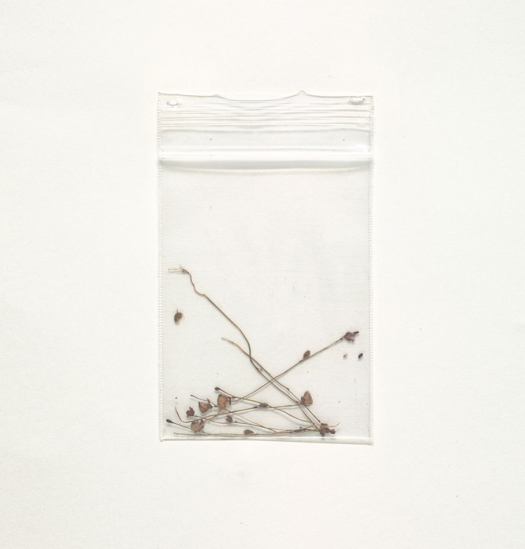
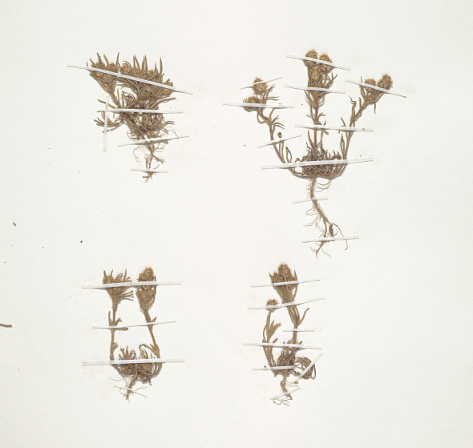

Jeffrey Klein is the author of [Curious Botany](#), the most-read blog about rare plants on the internet. He’s the host of the award-winning Embreea Talk podcast from PLNT.

Jeffrey is based in Portland, Maine and is an adjunct professor at the Quillwort School of Botany and Herbology.

## _Posts of Interest_

## [New Catalogs Now Available at the NYPL](#)

Feb 24, 2020

Jeffrey Klein is the author of Curious Botany, the most-read blog about rare plants on the internet.

## [New Catalogs Now Available at the NYPL](#)

Feb 24, 2020

Jeffrey Klein is the host of the award-winning Embreea Talk podcast from PLNT and NPR.

# [Nature’s Art:  
Plants and Their  
_Something_](#)
